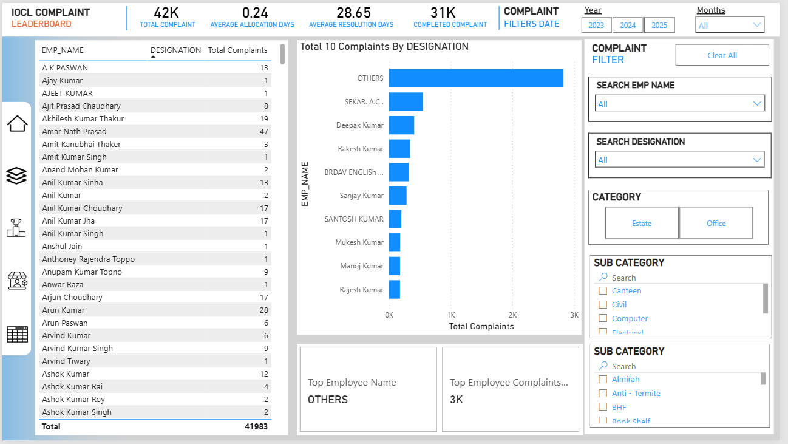

# complaint_dashboard
This repository contains a Power BI dashboard used to monitor and analyze complaints submitted across various departments and categories. It provides a clear, interactive view of complaint trends, resolution times, responsible teams, and more.
---

## 🚀 Dashboard Pages Overview

| Page Name        | Purpose                                                                |
|------------------|-------------------------------------------------------------------------|
| **Leaderboard**  | Highlights top performing complaint handlers or departments             |
| **Categories**   | Shows breakdown of complaints by type (e.g., Electrical, Plumbing)      |
| **KPI Page**     | Key metrics like resolution time, open cases, closure rate              |
| **Employee View**| Individual-level complaint handling data and efficiency                 |

---

## 🧼 Data Cleaning & Transformation

### 🔄 Power Query Editor Steps:

1. **Source Connection**
   - Connected to Excel/CSV/MySQL (depending on your version)
   - Used navigation to select relevant complaint tables

2. **Data Type Fixing**
   - Converted date/time fields to `Date` or `DateTime`
   - Ensured numerical fields like `complaint count`, `days open`, `response time` were in correct format

3. **Null Handling**
   - Removed rows with null complaint IDs
   - Replaced empty descriptions with `"Not Provided"`

4. **Renaming Columns**
   - Applied clean naming conventions (e.g., `Emp_Name`, `Complaint_Type`, `Status`)

5. **Calculated Columns**
   - Added fields like:
     - `DaysToClose = Date Closed - Date Raised`
     - `StatusLabel = IF(Status = 'Resolved', 'Closed', 'Pending')`

6. **Custom Date Table**
   - Linked a proper date table for time intelligence (if used)
   - Used `Mark as Date Table` to enable period-based filtering

---

## 📈 KPIs Tracked

- Total Complaints
- Resolved vs. Pending
- Average Days to Resolve
- Complaints per Department
- Complaints per Employee
- Most Common Complaint Types
- Monthly Trends

---

## 🧩 Visualizations Used

| Visual Type        | Purpose                              |
|--------------------|--------------------------------------|
| Bar Charts         | Department-wise complaints           |
| Line Graphs        | Monthly trends                       |
| Cards              | KPIs like total complaints, avg days |
| Tables             | Complaint details by employee        |
| TreeMap / Pie      | Complaint type breakdown             |
| Slicers            | Filter by date, department, employee |

---

## 🏗️ Layout Design

- **Color Scheme:** Based on organization branding (e.g., blue/gray tones)
- **Slicers on Every Page:** For user-controlled filters (department, date, etc.)
- **Consistent Font & Padding:** Maintains clean look across pages
- **Bookmarks & Buttons:** Optional navigation panel for enhanced interactivity

---

## ⚙️ Requirements

- Power BI Desktop (version 2023 or later recommended)
- Source data connection (Excel, MySQL, or your format)
- Optional: Gateway for scheduled refresh (if connected to live data)

---

## 📸 Screenshots

> You can insert screenshots of the dashboard pages here.

```markdown





MIT License — free to use and modify
